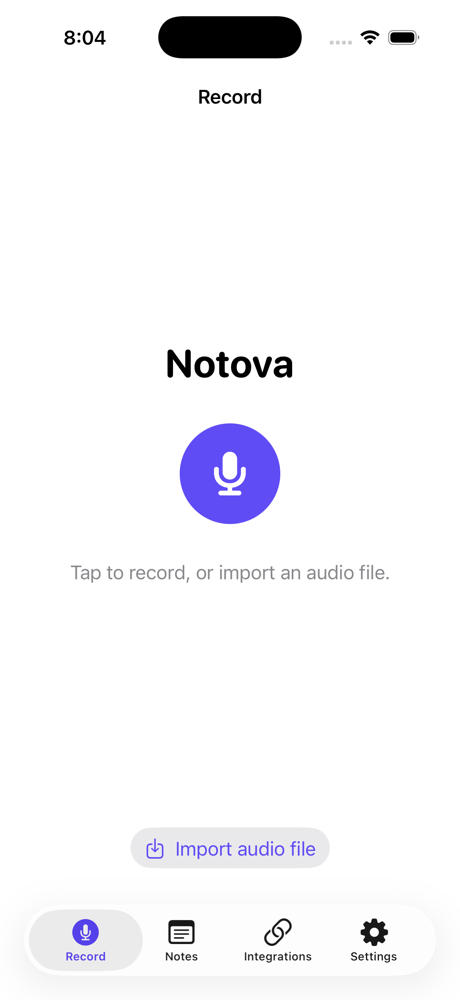
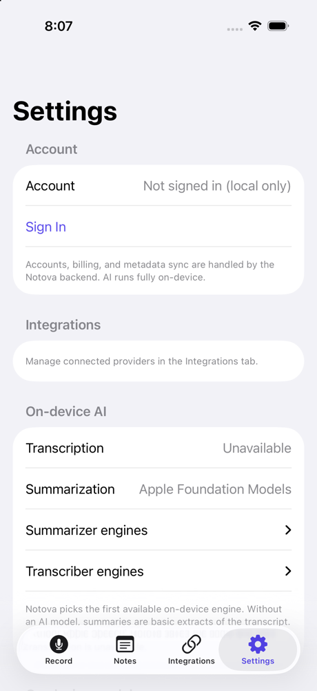
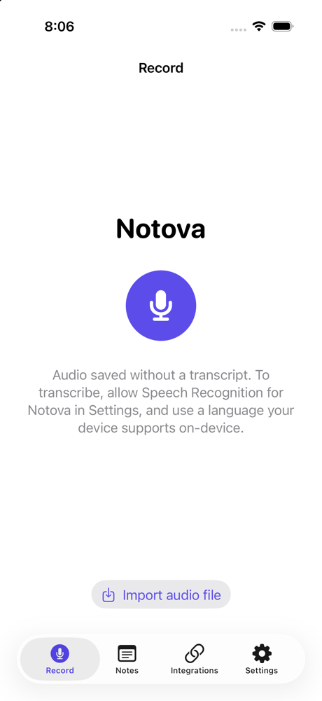

# Notova for iPhone and Mac

[](https://github.com/sandeepvijayarao09/notova-ios/actions/workflows/ios.yml)
[](LICENSE)

Record a meeting or voice memo, and Notova transcribes and summarizes it on the device.
No audio and no AI calls leave the phone.

<p>
  
  
  
</p>

<sub>Captured on the iOS 26.5 Simulator. The simulator has no on-device speech model, so the
third screen shows what Notova does then: it keeps the audio and says transcription is
unavailable, instead of inventing a transcript.</sub>

Part of Notova:
[notova-android](https://github.com/sandeepvijayarao09/notova-android) ·
[notova-backend](https://github.com/sandeepvijayarao09/notova-backend) ·
[roadmap](ROADMAP.md)

## Highlights

- **On-device pipeline.** Apple Speech (`requiresOnDeviceRecognition`) for transcripts;
  Apple Foundation Models (iOS 26+ with Apple Intelligence) or a local Gemma model via MLX
  for summaries and action items.
- **Honest fallbacks.** Engines are tried in priority order at call time by two Swift
  actors (`ResolvingTranscriber`, `ResolvingSummarizer`). With no AI model, the summary is a
  basic extract labelled as such. With no speech engine, the note is saved as audio only.
- **Settings shows what actually ran**, engine by engine.
- **Native macOS app** (`NotovaMac`) on the same packages.
- **Nine local Swift packages** (NotovaCore, AudioCapture, Transcription, AISummary,
  ModelManagement, Persistence, Integrations, Keychain, DesignSystem), SwiftData storage,
  Swift 6 strict concurrency, XcodeGen project.
- **298 XCTest cases**: 233 across the packages, 60 in the iOS app target, 5 in the Mac app.
  CI runs all of them plus SwiftLint (strict) on every push.

## Build and run

Requirements: Xcode 26 or newer, [XcodeGen](https://github.com/yonaskolb/XcodeGen)
(`brew install xcodegen`). The Xcode project is generated from `project.yml` and is not
committed.

```bash
git clone https://github.com/sandeepvijayarao09/notova-ios.git
cd notova-ios
xcodegen generate
open Notova.xcodeproj        # run the "Notova" scheme on a simulator or iPhone
```

Tap **Continue without an account** to use Notova locally. On a real iPhone, allow
Microphone and Speech Recognition when asked; transcription needs a language your device
supports on-device.

### Optional: local Gemma summaries (MLX)

MLX is Metal-only and pulled from the network, so it is off by default and not built in
CI. The AISummary manifest adds it only when `NOTOVA_ENABLE_MLX=1` is set in the
environment of the process that resolves packages (for example
`NOTOVA_ENABLE_MLX=1 xcodebuild -scheme Notova ...`). Then import a Gemma MLX model under
Settings → On-device models. Without it, summaries come from Apple Foundation Models
(where available) or the basic extract.

### Optional: accounts and export

Sign-in, sync and export go through [notova-backend](https://github.com/sandeepvijayarao09/notova-backend).
There is no public deployment. Run it locally (`npm run dev`, port 8787); the app's
default `NOTOVA_BACKEND_URL` is `http://localhost:8787`. Point a build at another
deployment with `xcodebuild ... NOTOVA_BACKEND_URL=https://your-host`. Of the export
providers, only Notion is implemented server-side.

## Tests

```bash
make test-all                 # every package + iOS unit tests + macOS tests
# or individually:
(cd Packages/NotovaCore && swift test)
xcodebuild test -project Notova.xcodeproj -scheme Notova \
  -destination 'platform=iOS Simulator,name=iPhone 17 Pro' \
  -only-testing:NotovaTests -collect-test-diagnostics never
xcodebuild test -project Notova.xcodeproj -scheme NotovaMac -destination 'platform=macOS'
```

The XCUITest target (`NotovaUITests`) runs locally only; UI automation on hosted CI
simulators is unreliable.

## Architecture

MVVM with `@Observable` view models. The app layer depends only on protocols from
NotovaCore; `AppContainer` (iOS) and `AppModel` (macOS) wire in concrete engines.

```
App (SwiftUI)
  └─ AppContainer
        ├─ PipelineService(Transcriber, Summarizer)      NotovaCore
        │     ├─ ResolvingTranscriber: Apple Speech       Transcription
        │     └─ ResolvingSummarizer: MLX Gemma →
        │          Foundation Models → basic extract      AISummary
        ├─ AudioRecorder (mic, Bluetooth, file import)    AudioCapture
        ├─ NoteRepository (SwiftData)                     Persistence
        ├─ NotovaBackendClient (/v1 REST)                 Integrations
        └─ KeychainTokenStore                             Keychain
```

| Package | Responsibility |
| --- | --- |
| `NotovaCore` | Domain models, protocols, `PipelineService`, errors, the basic extractive summarizer |
| `AudioCapture` | AVFoundation capture (mic / Bluetooth route) and file import |
| `Transcription` | `AppleSpeechTranscriber`, `ResolvingTranscriber` |
| `AISummary` | `LocalGemmaSummarizer` (MLX), `AppleFoundationModelsSummarizer`, `ResolvingSummarizer` |
| `ModelManagement` | Model files on disk: import, download from a URL, detect, delete |
| `Persistence` | SwiftData entities and `NoteRepository` |
| `Integrations` | `NotovaBackendClient` for auth, integrations, export, sync, billing |
| `Keychain` | Token storage |
| `DesignSystem` | Color, type and spacing tokens and shared components |

## Status

v1.0.0 is a source release. There is no App Store or TestFlight build yet; see
[RELEASE.md](RELEASE.md) and [LAUNCH.md](LAUNCH.md) for what submission needs.

## License

Apache-2.0. See [LICENSE](LICENSE) and [NOTICE](NOTICE).
